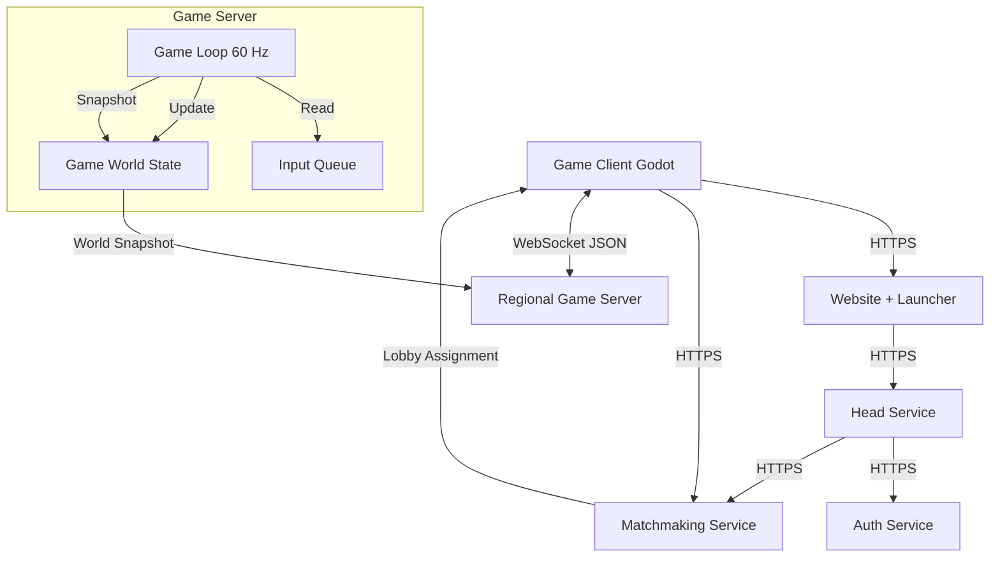

# Jet Raiders - Multiplayer Architecture Plan

This document outlines the architecture for converting the "Jet Raiders" Godot game
from a peer-to-peer/host-based model to a robust Client-Server Authoritative
model using Rust.

## 1. High-Level Architecture

We are moving to a **Server-Authoritative** model. The game server is the single
source of truth. Clients are "dumb" terminals that send inputs and render the
state received from the server.



## 1.1 Service Boundaries

The platform is decomposed into reusable services:

- **Website + Launcher**: Frontpage, marketing content, and game entry point.
- **Head Service**: Account/profile APIs and coordination for session and match
  flow.
- **Auth Service**: Login validation and session token issuance.
- **Matchmaking Service**: Queue management and lobby assignment.
- **Game Server**: Real-time simulation and authoritative state per lobby.

## 1.2 Multi-Lobby Architecture

The server acts as a **Lobby Manager**.

1. **Assignment**: Matchmaking returns a `lobby_id` and server address.
2. **Connection**: Client connects to `ws://server/ws`.
3. **Handshake**: Client sends `Join { lobby_id: "Room1" }`.
4. **Routing**:
    - If "Room1" exists: Connect client to that running game loop.
    - If "Room1" is missing: Create a new `GameLoop` task for it.
5. **Isolation**: Each Lobby runs in its own Tokio Task. A crash or lag spike
    in one lobby does not affect others.

## 1.3 Client Authentication Path

The game client should authenticate through the head service, which then calls
the auth service to validate login proofs and issue session tokens. This keeps
the auth service reusable and avoids forcing the client to integrate with auth
endpoints directly, while still allowing optional direct auth access for
launcher-only flows.

## 2. Repository Layout

The repository now includes directories for the planned services:

```text
auth_server/         # Auth service (token issuance/verification).
game_client/         # Godot client project (target home).
game_server/         # Current Axum game server (to split out later).
head_server/         # Head service (profile, platform APIs).
matchmaking_server/  # Matchmaking service (queue + assignment).
website/             # Frontpage/launcher.
```

## 3. Game Server Project Structure (`game_server/src/`)

We will use a modular "Simple Structs" approach. We will implement **Multiple
Lobbies** support, where the main server manages multiple isolated game
sessions.

```text
game_server/
├── Cargo.toml          # Dependencies: axum, tokio, serde, etc.
└── src/
    ├── main.rs         # Entry point. Delegates to frameworks/server.rs.
    ├── domain/         # Entities + rules.
    │   ├── mod.rs
    │   ├── state.rs
    │   ├── systems/
    │   │   ├── mod.rs
    │   │   ├── ship_movement.rs
    │   │   └── projectiles.rs
    │   └── tuning/
    │       ├── mod.rs
    │       ├── player.rs
    │       └── projectile.rs
    ├── use_cases/      # Game loop orchestration.
    │   ├── mod.rs
    │   ├── game.rs
    │   ├── lobby.rs
    │   └── types.rs
    ├── interface_adapters/  # Networking + protocol DTOs.
    │   ├── mod.rs
    │   ├── net.rs
    │   ├── protocol.rs
    │   ├── state.rs
    │   └── utils/
    │       ├── mod.rs
    │       └── rng.rs
    └── frameworks/     # Runtime wiring and config.
        ├── mod.rs
        ├── config.rs
        └── server.rs
```

## 4. Communication Protocol (`protocol.rs`)

We will use JSON for messages initially for easy debugging.

### Client -> Server (`ClientMessage`)

Sent by the Godot client to the Rust server.

```rust
enum ClientMessage {
    // Initial handshake to join a specific room
    Join { lobby_id: String, username: String },

    // Sent every frame/tick by the client
    Input {
        thrust: bool,       // W / Up
        turn: f32,          // -1.0 (Left) to 1.0 (Right)
        shoot: bool,        // Space
    },

    // Heartbeat to keep connection alive
    Ping,
}
```

### Server -> Client (`ServerMessage`)

Sent by the Rust server to the Godot client.

```rust
enum ServerMessage {
    // The main sync message. Sent every tick (or every X ticks).
    WorldSnapshot {
        players: Vec<PlayerData>,
        projectiles: Vec<ProjectileData>,
        server_time: f64,
    },

    // Specific events that might trigger sounds or visual effects
    GameEvent(GameEvent),

    Pong,
}

enum GameEvent {
    PlayerJoined { id: u64, name: String },
    PlayerLeft { id: u64 },
    PlayerDied { victim_id: u64, killer_id: u64 },
}
```

## 5. Game State Data (`state.rs`)

The `GameState` struct holds the entire world.

```rust
pub struct GameState {
    pub players: HashMap<u64, Player>,
    pub projectiles: Vec<Projectile>,
    pub map_width: f32,
    pub map_height: f32,
}

pub struct Player {
    pub id: u64,
    pub name: String,
    pub position: Vec2, // x, y
    pub rotation: f32,  // radians
    pub velocity: Vec2,
    pub health: f32,
    pub score: i32,
    pub input: PlayerInput, // Last received input
}

pub struct Projectile {
    pub id: u64,
    pub owner_id: u64,
    pub position: Vec2,
    pub velocity: Vec2,
    pub life_time: f32, // Remaining time to live
}
```

## 6. The Game Loop (`game.rs`)

The server runs at a fixed tick rate (e.g., 60 ticks per second).

**Loop Cycle:**

1. **Sleep**: Wait until the next tick time (ensures consistent speed).
2. **Process Inputs**: Drain the `InputQueue`. Update `Player.input` for each client.
3. **Run Systems**:
   - `ship_movement::update(&mut state)`: Apply thrust, update positions, wrap
     around map borders.
   - `projectiles::update(&mut state)`: Move projectiles, check collisions (AABB or
     Circle), apply damage, handle respawns.
4. **Broadcast State**: Serialize `GameState` into a `WorldSnapshot` and
   send it to all connected clients via `net.rs`.

## 7. Client Notes

Client refactor details live alongside the Godot project and game client docs.
The client remains responsible for sending inputs and rendering server
snapshots.

## 8. Future Extensibility

- **New Weapons**: Add a `weapon_type` enum to `Player` and switch logic in `projectiles.rs`.
- **Power-ups**: Add a `Vec<PowerUp>` to `GameState` and a `powerup.rs` system.
- **Binary Protocol**: Switch `serde_json` to `bincode` in `net.rs` for smaller
  packets (better performance) without changing game logic.
