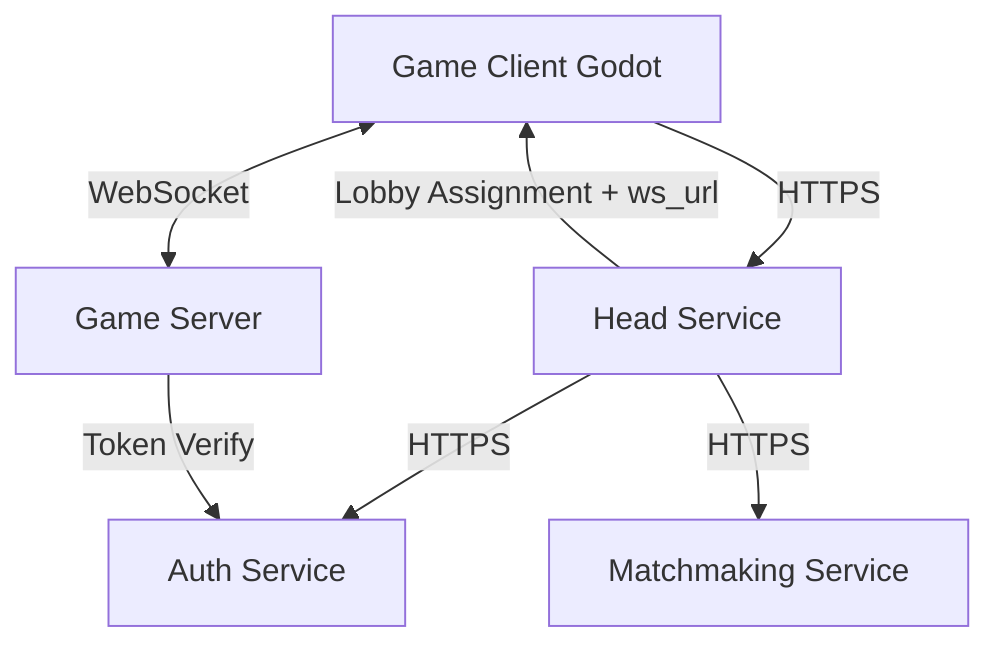

# Jet Raiders Architecture

This document is the top-level architecture reference for the Jet Raiders
multi-service platform. It aligns with repository-wide
`CLEAN_ARCHITECTURE_GUIDELINES.md`.

## 1. High-Level Model

Jet Raiders uses a server-authoritative multiplayer model:

- The game server is the authoritative source of world state.
- Clients send input and render server snapshots.
- Account and matchmaking flows are orchestrated through the head service.



## 2. Service Boundaries

- **Head service**: platform entry point, profile/session orchestration, and
  matchmaking coordination.
- **Auth service**: identity proof validation, session token issuance, and token
  verification.
- **Matchmaking service**: queue and match assignment logic.
- **Game server**: real-time simulation and authoritative gameplay state.
- **Website/launcher**: distribution and marketing surface; can delegate runtime
  flows to head service.

## 3. Current State and Target State

Status snapshot as of **February 28, 2026**:

- `auth_server/`, `head_server/`, `game_server/`, and `matchmaking_server/`
  are runnable Rust services.
- `head_server/` currently exposes guest identity/session HTTP APIs and forwards
  those flows to `auth_server/`.
- `website/` is still in scaffold/placeholder stage.
- The active Godot project lives in `game_client/`.

## 4. Repository Layout

```text
auth_server/         # Auth service (token issuance/verification).
game_client/         # Current live Godot project.
game_server/         # Real-time authoritative game server.
head_server/         # Platform entry service (profiles/session orchestration).
matchmaking_server/  # Queue + match assignment service.
website/             # Frontpage/launcher surface.
```

## 5. Clean Architecture Mapping

Each service follows the same inward dependency direction:

- `domain/`: core business entities and invariants.
- `use_cases/` (or `application/`): orchestration and workflows.
- `interface_adapters/`: DTOs, protocol translation, input/output mapping.
- `frameworks/`: runtime wiring, server bootstrapping, integrations.

Key rule:

- Domain types are authoritative.
- Transport DTOs must stay in adapter layers.
- Any temporary exception must follow the guardrails in
  `CLEAN_ARCHITECTURE_GUIDELINES.md`.

## 6. Game Server Architecture (`game_server/src/`)

The game server uses multi-lobby orchestration where each lobby is isolated in
its own async task. A lobby crash or slowdown should not affect other lobbies.

```text
game_server/
├── Cargo.toml
└── src/
    ├── main.rs
    ├── domain/
    │   ├── state.rs
    │   ├── systems/
    │   └── tuning/
    ├── use_cases/
    │   ├── game.rs
    │   ├── lobby.rs
    │   └── types.rs
    ├── interface_adapters/
    │   ├── clients/
    │   ├── http.rs
    │   ├── net/
    │   ├── protocol.rs
    │   ├── state.rs
    │   └── utils/
    └── frameworks/
        ├── config.rs
        └── server.rs
```

## 7. Multiplayer Session Flow

1. Client authenticates through head service.
2. Head service validates/obtains session via auth service.
3. Head service requests assignment from matchmaking service.
4. Client receives `lobby_id` and game server WebSocket endpoint.
5. Client connects to game server and joins assigned lobby.
6. Game server validates identity/session (directly or via auth-backed token
   verification).
7. Client sends input; server runs simulation ticks and broadcasts snapshots.

Current implemented head-service entrypoints:

- `POST /guest/init`: creates guest identity through auth and returns
  `guest_id`, `session_token`, and `expires_at`.
- `POST /guest/login`: creates/refreshes guest session through auth and returns
  `session_token` and `expires_at`.

## 8. Protocol and Tick Model (Planned Interface)

Transport starts with JSON messages for fast debugging and iteration. Protocol
types belong to adapter layers (`interface_adapters/protocol.rs`) and are
converted at boundaries.

Target loop model:

1. Read player input.
2. Update domain state via game systems.
3. Build snapshot output.
4. Broadcast to lobby participants on a fixed tick rate.

Protocol encoding can move to a binary format later without changing domain
rules.

## 9. Related Documents

- `CLEAN_ARCHITECTURE_GUIDELINES.md`
- `game_server/CLEAN_ARCHITECTURE_GUIDELINES.md`
- `TRACING.md`
- `auth_server/ARCHITECTURE.md`
- `head_server/README.md`
