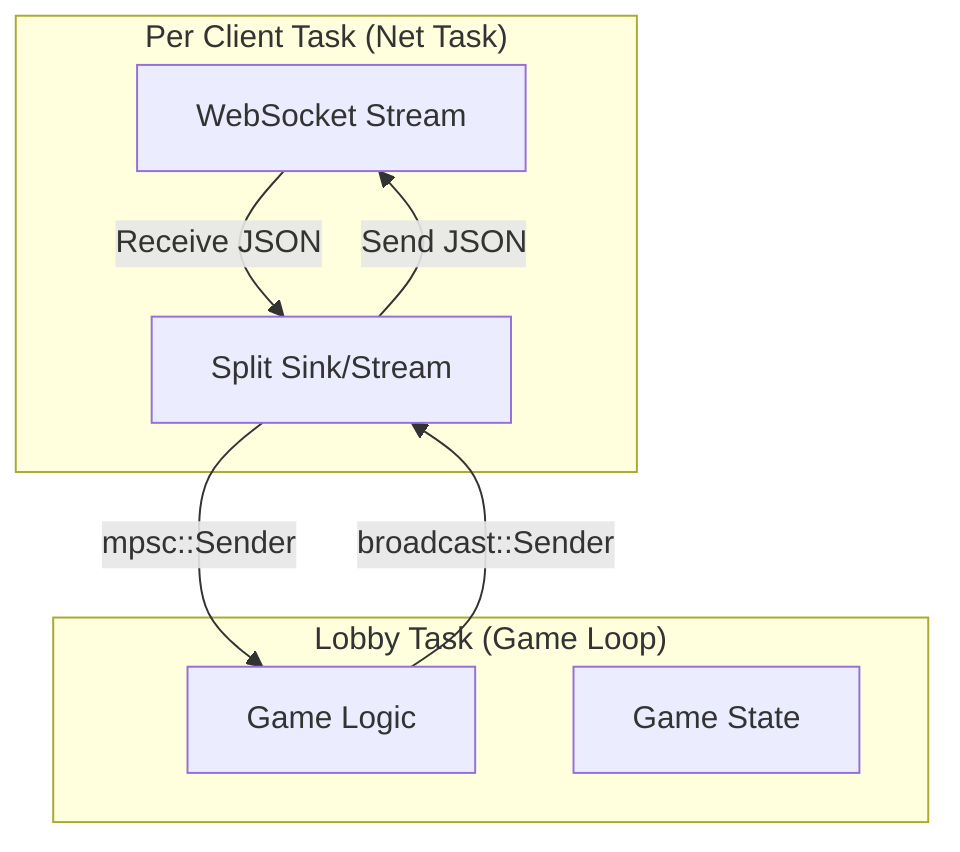

# Jet Raiders - Networking Implementation Deep Dive

This document details the specific Axum and Tokio patterns used for client-server
communication. It explains **why** specific channel types were chosen to handle
concurrency efficiently.

## 1. Data Flow Architecture

The server uses a **Actor-like** model where each connection and game loop runs
in its own isolated asynchronous task.

## 2. Channel Selection Strategy

We use different Tokio channel primitives depending on the communication
pattern.

### A. Client Input -> Game Loop (`mpsc`)

**Type**: `tokio::sync::mpsc` (Multi-Producer, Single-Consumer)

- **Usage**: All connected clients send their `Input` packets to the single
  Game Loop running the simulation.
- **Why Chosen**:
  - **Many-to-One**: Even with 4-5 clients (Producers) talking to 1 Game
    Loop (Consumer), this pattern cleanly separates input handling.
  - **Buffering**: It handles backpressure. If the Game Loop stalls, the
    channel fills up, eventually forcing clients to wait (preventing memory
    leaks).
  - **Ordering**: Guarantees that messages from _a single client_ arrive
    in order.

### B. Game Loop -> Clients (`broadcast`)

**Type**: `tokio::sync::broadcast`

- **Usage**: The Game Loop finishes a tick, generates a `WorldSnapshot`, and
  sends it to _everyone_.
- **Why Chosen**:
- **One-to-Many**: One producer (Game Loop) sends to multiple consumers
  (Client Net Tasks).
- **Cloning**: It handles the distribution efficiently.
- **Lag Handling**: If a client is too slow and the buffer fills, they
  get a `Lagged` error. This allows us to drop old snapshots for slow
  clients (which is desirable in real-time games) rather than slowing
  down the entire server.

### C. Server Control / Shutdown (`watch`)

**Type**: `tokio::sync::watch`

- **Usage**: Signaling the game status (e.g., "Game Over", "Server
  Stopping").
- **Why Chosen**:
  - **Latest Value Only**: We don't care about the history of status
    changes, only the _current_ state. `watch` overwrites previous values
    if not read immediately, which is ideal for status flags.
  - **Efficiency**: Extremely lightweight. Receivers just inspect the
    value.

### Broadcast vs. Watch for World State

While `watch` is efficient for status, `broadcast` is preferred for `WorldSnapshot`s.
`broadcast` ensures every snapshot is received (or explicitly noted as `Lagged`),
allowing clients to process a sequence of updates for smooth animation. `watch`
would only provide the _latest_ state, causing clients to miss intermediate
updates and potentially leading to jerky movement.

## 3. Serialization Strategy (The "Net Task" Pattern)

To keep the **Game Loop** fast (60 Hz target), we offload work to the
**Net Tasks**.

- **Bad Pattern**: Game Loop serializes the huge JSON string and sends it.
  - _Result_: Game Loop CPU usage spikes with high player count.
- **Good Pattern (Our Approach)**:
  1. Game Loop sends the raw `WorldSnapshot` struct (Arc/Clone) via
      `broadcast`.
  2. Each individual **Net Task** receives the struct.
  3. Each **Net Task** serializes it to JSON _in parallel_.

This utilizes all CPU cores for serialization, leaving the main core free for
physics.

## 4. Tokio & Axum Integration

- **Axum**: Handles the initial HTTP Upgrade to WebSocket. It gives us a
  `WebSocket` stream.
- **Tokio**: We immediately `tokio::spawn` a new task to handle this
  stream.
  - This ensures the HTTP server remains responsive to new connection
    requests even if the game is heavy.

## 5. Future Optimizations: Binary Protocols

Currently, we use JSON for ease of debugging and development. However, for a
production game, especially in a bandwidth-constrained environment or at scale,
binary serialization is preferred.

- **Goal**: Transition from `serde_json` to a more efficient binary format.
- **Candidates**:
  - **Bincode**: Simple, Rust-native binary serialization, good for Rust-Rust
    communication.
  - **MessagePack (MsgPack)**: Cross-language binary format, good for
    Rust-Godot interop if Godot has a good MsgPack library.
  - **Protobuf / Flatbuffers**: More complex, but offers schema evolution
    and high performance.
- **Impact**: This change would primarily affect `net.rs` (the serialization
  logic) and the Godot client's deserialization. The core `GameLoop` and game
  state logic (`protocol.rs`, `state.rs`) would remain largely unchanged,
  thanks to `serde`'s abstraction.
