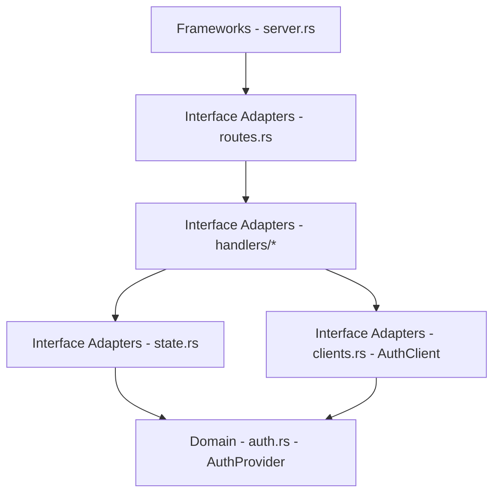

# Head Service

## Purpose

The head service is the front door for the Jet Raiders platform. It serves the
primary web UI, coordinates account flows, and provides shared platform APIs
that are not part of real-time gameplay.

## Responsibilities

- Serve the web app and game shell.
- Orchestrate account onboarding and profile management.
- Host general platform APIs (friends, party management, inventory).
- Forward users to matchmaking once authenticated.
- Cache platform configuration (regions, feature flags, news).

## Client Access Pattern

The head service is the preferred entry point for client identity flows. The
game client should authenticate through head endpoints, and the head service
should call the auth service on the client's behalf to issue or verify session
tokens. This keeps the auth service game-agnostic and avoids requiring clients
to integrate directly with auth endpoints unless a dedicated launcher needs to
bypass the head service for a specific flow.

## Current Axum Server Functionality to Extract

- Move guest profile persistence (guest ID, display name, metadata JSON) out of
  the real-time WebSocket join path and into profile APIs owned by the head
  service.
- Normalize display name rules (max length, default name) in the head service
  so the game server only receives validated profile data.
- Adopt the existing guest profile upsert flow as a first-class head service
  API so guest identity creation, naming, and metadata storage happen before
  the client connects to a game server.

## External Interfaces

### HTTP API

- `GET /app`
  - Serves the web application shell.
- `GET /profile`
  - Returns user profile data.
- `POST /profile/update`
  - Updates user profile data.
- `POST /party/create`
  - Creates a party for a group of players.
- `POST /party/invite`
  - Invites a player to a party.
- `POST /party/leave`
  - Leaves the current party.

## Data Contracts

### User Profile

- `user_id`: canonical user ID.
- `display_name`: player-facing name.
- `created_at`: account creation time.

### Party State (future)

- `party_id`: unique party identifier.
- `leader_id`: current party leader.
- `member_ids`: list of current members.

## Security Considerations

- Validate session tokens with the auth service.
- Enforce CSRF protection for session-bound requests.
- Rate limit endpoints that modify player state.

## Dependencies

- Auth service for session validation.
- Data store for profile and party data.
- CDN or storage service for web assets.

## Observability

- Track API latency and error rates.
- Log user actions with correlation IDs.
