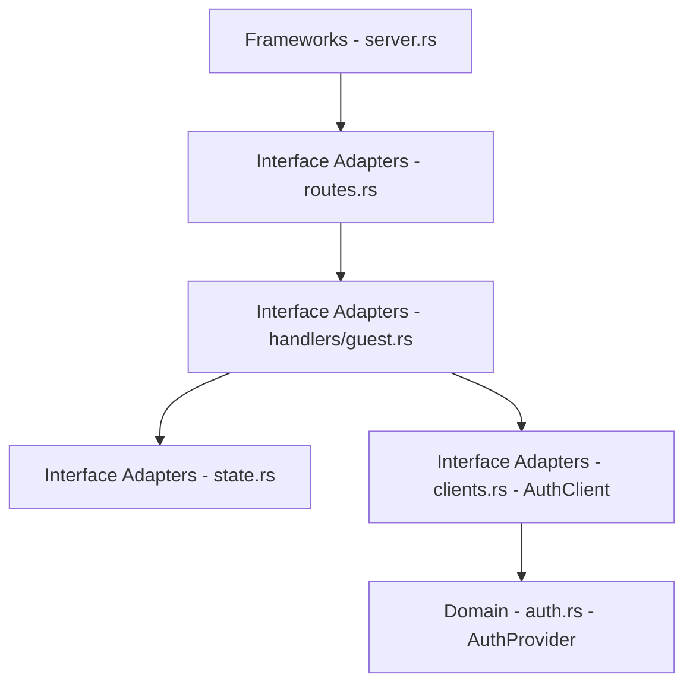

# Head Service



## Purpose

The head service is currently the HTTP entry point for guest identity/session
flows used by the game client. It proxies guest auth operations to
`auth_server`.

## Architecture Guidelines

Follow `CLEAN_ARCHITECTURE_GUIDELINES.md` and the service architecture docs
under `head_server/`.

## Current Scope (Implemented)

- Accept guest identity/session requests from clients.
- Call `auth_server` to create guest identities and guest sessions.
- Return head-level response DTOs suitable for client usage.

## HTTP API (Implemented)

### `POST /guest/init`

Creates a first-time guest identity and returns a session token.

Request:

```json
{
  "display_name": "Pilot_42"
}
```

Success response:

```json
{
  "guest_id": "123456789",
  "session_token": "uuid-token",
  "expires_at": "<unix_epoch_seconds>"
}
```

### `POST /guest/login`

Creates or refreshes a guest session for an existing guest ID.

Request:

```json
{
  "guest_id": "123456789",
  "display_name": "Pilot_42"
}
```

Success response:

```json
{
  "session_token": "uuid-token",
  "expires_at": "<unix_epoch_seconds>"
}
```

## Error Behavior

- Invalid `guest_id` format in `/guest/login` returns `400`.
- Upstream 4xx responses from `auth_server` are preserved where possible.
- Upstream transport/failure conditions return `502`.

## Runtime and Configuration

- Bind address: `127.0.0.1:3000`
- Auth base URL env var: `AUTH_SERVICE_URL`
- Default auth base URL: `http://localhost:3002`
- Tracing controls: `RUST_LOG`, optional `LOG_FORMAT=json`

## Dependencies

- `auth_server` for guest identity/session operations.

## Planned (Not Implemented Yet)

The following items are planned platform responsibilities, but are not
implemented in current routes:

- web app shell endpoints
- profile management endpoints
- party/friends/inventory endpoints
- matchmaking orchestration endpoints
