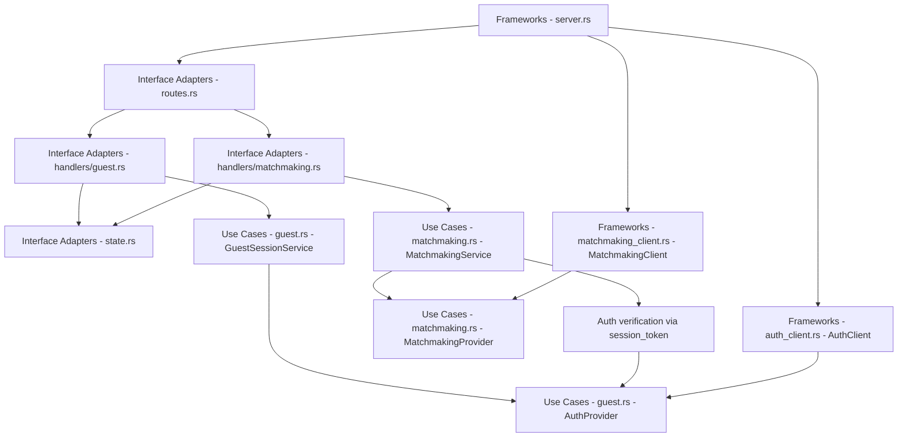

# Head Service


```mermaid
flowchart TD
    F[Frameworks - server.rs] --> R[Interface Adapters - routes.rs]
    R --> H[Interface Adapters - handlers/guest.rs]
    R --> M[Interface Adapters - handlers/matchmaking.rs]
    H --> S[Interface Adapters - state.rs]
    H --> U[Use Cases - guest.rs - GuestSessionService]
    M --> S
    M --> Q[Use Cases - matchmaking.rs - MatchmakingService]
    U --> P[Use Cases - guest.rs - AuthProvider]
    Q --> V[Auth verification via session_token]
    V --> P
    Q --> P2[Use Cases - matchmaking.rs - MatchmakingProvider]
    F --> C[Frameworks - auth_client.rs - AuthClient]
    F --> K[Frameworks - matchmaking_client.rs - MatchmakingClient]
    C --> P
    K --> P2
```

## Purpose

The head service is the HTTP entry point for guest identity/session flows and
the first matchmaking queue-entry slice used by the game client. It proxies
guest auth operations to `auth_server` and matchmaking queue entry to
`matchmaking_server`.

## Architecture Guidelines

Follow `CLEAN_ARCHITECTURE_GUIDELINES.md` and the service architecture docs
under `head_server/`.

## Current Scope (Implemented)

- Accept guest identity/session requests from clients.
- Orchestrate guest identity/session flows through use cases.
- Call `auth_server` to create guest identities and guest sessions via a port.
- Accept matchmaking queue-entry requests from clients.
- Verify `session_token` through auth before queueing canonical player identity.
- Orchestrate matchmaking queue entry through a dedicated use-case service.
- Accept matchmaking polling requests keyed by `ticket_id`.
- Proxy ticket status lookup to `matchmaking_server` through the same dedicated
  matchmaking use-case boundary.
- Call `matchmaking_server` through a dedicated reqwest client port.
- Return head-level response DTOs suitable for client usage.

## HTTP API (Implemented)

### `POST /guest/init`

Creates a first-time guest identity and returns a session token.

Request:

```json
{
  "display_name": "Pilot_42"
}
```

Success response:

```json
{
  "guest_id": "123456789",
  "session_token": "uuid-token",
  "expires_at": "<unix_epoch_seconds>"
}
```

### `POST /guest/login`

Creates or refreshes a guest session for an existing guest ID.

Request:

```json
{
  "guest_id": "123456789",
  "display_name": "Pilot_42"
}
```

Success response:

```json
{
  "session_token": "uuid-token",
  "expires_at": "<unix_epoch_seconds>"
}
```

### `POST /matchmaking/queue`

Submits a matchmaking queue request through head.

Request:

```json
{
  "session_token": "uuid-token",
  "player_skill": 1200,
  "region": "eu-west"
}
```

Waiting response:

```json
{
  "status": "waiting",
  "ticket_id": "ticket-123",
  "region": "eu-west"
}
```

Immediate match response:

```json
{
  "status": "matched",
  "match_id": "match-123",
  "opponent_id": "player-7",
  "region": "eu-west"
}
```

### `GET /matchmaking/queue/{ticket_id}`

Polls the current status of a previously issued queue ticket.

Waiting response:

```json
{
  "status": "waiting",
  "ticket_id": "ticket-123",
  "region": "eu-west"
}
```

Current matched response during phase 2:

```json
{
  "status": "matched",
  "match_id": "match-123",
  "opponent_id": "player-7",
  "region": "eu-west"
}
```

## Error Behavior

- Invalid `guest_id` format in `/guest/login` returns `400`.
- Upstream 4xx responses from `auth_server` are preserved where possible.
- Invalid or expired `session_token` in `/matchmaking/queue` returns `401`.
- Upstream transport/failure conditions return `502`.
- Invalid matchmaking requests return `400`.
- Upstream matchmaking `409` responses return `409`.
- Unknown `ticket_id` values in `/matchmaking/queue/{ticket_id}` return `404`.
- Matchmaking transport/failure conditions return `502`.
- The queue-entry flow does not create lobbies yet; matched responses are
  surfaced directly from the matchmaking service contract for now.
- The polling flow also does not create lobbies yet in phase 2; a poll that
  reports `matched` still reflects the upstream matchmaking state rather than a
  completed game-server handoff.

## Runtime and Configuration

- Bind address: `127.0.0.1:3000`
- Auth base URL env var: `AUTH_SERVICE_URL`
- Default auth base URL: `http://localhost:3002`
- Matchmaking base URL env var: `MATCHMAKING_SERVICE_URL`
- Default matchmaking base URL: `http://localhost:3003`
- Tracing controls: `RUST_LOG`, optional `LOG_FORMAT=json`

## Dependencies

- `auth_server` for guest identity/session operations.
- `matchmaking_server` for queue-entry orchestration and ticket polling.

## Layer Notes

- `interface_adapters/` owns head HTTP DTOs, request validation, and HTTP error mapping.
- `use_cases/` owns guest session orchestration, matchmaking queue orchestration,
  matchmaking ticket polling, and the `AuthProvider` / `MatchmakingProvider`
  ports.
- `frameworks/` owns the concrete reqwest auth and matchmaking clients plus runtime wiring.
- `domain/` is reserved for future head-specific business entities and invariants.

## Planned (Not Implemented Yet)

The following items are planned platform responsibilities, but are not
implemented in current routes:

- web app shell endpoints
- profile management endpoints
- party/friends/inventory endpoints
- matchmaking cancellation endpoints
- lobby handoff and regional game-server routing
