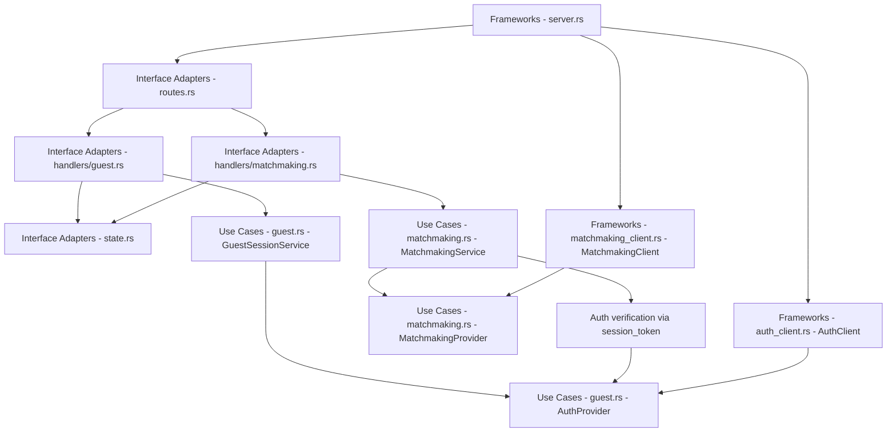

# Head Service


```mermaid
flowchart TD
    F[Frameworks - server.rs] --> R[Interface Adapters - routes.rs]
    R --> H[Interface Adapters - handlers/guest.rs]
    R --> M[Interface Adapters - handlers/matchmaking.rs]
    H --> S[Interface Adapters - state.rs]
    H --> U[Use Cases - guest.rs - GuestSessionService]
    M --> S
    M --> Q[Use Cases - matchmaking.rs - MatchmakingService]
    U --> P[Use Cases - guest.rs - AuthProvider]
    Q --> V[Auth verification via session_token]
    V --> P
    Q --> P2[Use Cases - matchmaking.rs - MatchmakingProvider]
    F --> C[Frameworks - auth_client.rs - AuthClient]
    F --> K[Frameworks - matchmaking_client.rs - MatchmakingClient]
    C --> P
    K --> P2
```

## Purpose

The head service is the HTTP entry point for guest identity/session flows and
the client-facing matchmaking lifecycle. It proxies guest auth operations to
`auth_server`, consumes stable ticket lifecycle state from
`matchmaking_server`, and completes game-server lobby handoff before returning
final matched responses.

## Architecture Guidelines

Follow `CLEAN_ARCHITECTURE_GUIDELINES.md` and the service architecture docs
under `head_server/`.

## Current Scope (Implemented)

- Accept guest identity/session requests from clients.
- Orchestrate guest identity/session flows through use cases.
- Call `auth_server` to create guest identities and guest sessions via a port.
- Accept matchmaking queue-entry requests from clients.
- Verify `session_token` through auth before queueing canonical player identity.
- Orchestrate matchmaking queue entry through a dedicated use-case service.
- Accept matchmaking polling requests keyed by `ticket_id`.
- Accept matchmaking cancellation requests keyed by `ticket_id`.
- Proxy ticket status lookup and cancellation to `matchmaking_server` through
  the same dedicated matchmaking use-case boundary.
- Resolve the target game server by region and create lobbies for matched
  tickets before returning final client-visible match responses.
- Call `matchmaking_server` through a dedicated reqwest client port.
- Return head-level response DTOs suitable for client usage.

## HTTP API (Implemented)

### `POST /guest/init`

Creates a first-time guest identity and returns a session token.

Request:

```json
{
  "display_name": "Pilot_42"
}
```

Success response:

```json
{
  "guest_id": "123456789",
  "session_token": "uuid-token",
  "expires_at": "<unix_epoch_seconds>"
}
```

### `POST /guest/login`

Creates or refreshes a guest session for an existing guest ID.

Request:

```json
{
  "guest_id": "123456789",
  "display_name": "Pilot_42"
}
```

Success response:

```json
{
  "session_token": "uuid-token",
  "expires_at": "<unix_epoch_seconds>"
}
```

### `POST /matchmaking/queue`

Submits a matchmaking queue request through head.

Request:

```json
{
  "session_token": "uuid-token",
  "player_skill": 1200,
  "region": "eu-west"
}
```

Waiting response:

```json
{
  "status": "waiting",
  "ticket_id": "ticket-123",
  "region": "eu-west"
}
```

Game-ready matched response:

```json
{
  "status": "matched",
  "ticket_id": "ticket-123",
  "match_id": "match-123",
  "lobby_id": "match-123",
  "ws_url": "ws://localhost:3001/ws",
  "region": "eu-west"
}
```

### `GET /matchmaking/queue/{ticket_id}`

Polls the current status of a previously issued queue ticket.

Request header:

```text
Authorization: Bearer <session_token>
```

Waiting response:

```json
{
  "status": "waiting",
  "ticket_id": "ticket-123",
  "region": "eu-west"
}
```

Canceled response:

```json
{
  "status": "canceled",
  "ticket_id": "ticket-123",
  "region": "eu-west"
}
```

Game-ready matched response:

```json
{
  "status": "matched",
  "ticket_id": "ticket-123",
  "match_id": "match-123",
  "lobby_id": "match-123",
  "ws_url": "ws://localhost:3001/ws",
  "region": "eu-west"
}
```

### `DELETE /matchmaking/queue/{ticket_id}`

Cancels a waiting matchmaking ticket through head.

Request header:

```text
Authorization: Bearer <session_token>
```

## Error Behavior

- Invalid `guest_id` format in `/guest/login` returns `400`.
- Upstream 4xx responses from `auth_server` are preserved where possible.
- Invalid or expired `session_token` in `/matchmaking/queue` returns `401`.
- Upstream transport/failure conditions return `502`.
- Invalid matchmaking requests return `400`.
- Upstream matchmaking `409` responses return `409`.
- Unknown `ticket_id` values in `/matchmaking/queue/{ticket_id}` return `404`.
- Canceling a matched `ticket_id` returns `409`.
- Matchmaking transport/failure conditions return `502`.
- A `matched` response is only returned after head has successfully ensured the
  target game-server lobby exists.

## Runtime and Configuration

- Bind address: `127.0.0.1:3000`
- Auth base URL env var: `AUTH_SERVICE_URL`
- Default auth base URL: `http://localhost:3002`
- Matchmaking base URL env var: `MATCHMAKING_SERVICE_URL`
- Default matchmaking base URL: `http://localhost:3003`
- Shared region config env var override: `REGION_CONFIG_PATH`
- Default shared region config path: `../config/regions.toml`
- Startup fails fast if the shared region config is missing, unreadable,
  malformed, empty, has duplicate `matchmaking_key` values, omits required
  fields, or contains invalid game-server URLs.
- Head resolves regions by exact `matchmaking_key` only.
- Head does not trim, lowercase, or fall back to a default route when
  matchmaking returns an unknown region.
- Tracing controls: `RUST_LOG`, optional `LOG_FORMAT=json`

The shared config file maps concrete matchmaking region values to the internal
game-server base URL used for lobby creation and the client-visible `ws_url`
returned in matched responses. Local development defaults live in
`../config/regions.toml`.

## Dependencies

- `auth_server` for guest identity/session operations.
- `matchmaking_server` for queue lifecycle orchestration.
- `game_server` for lobby creation before final matched responses are returned.

## Layer Notes

- `interface_adapters/` owns head HTTP DTOs, request validation, and HTTP error mapping.
- `use_cases/` owns guest session orchestration, matchmaking queue orchestration,
  matchmaking ticket polling and cancellation, and the upstream service ports.
- `frameworks/` owns the concrete reqwest auth, matchmaking, and game-server
  clients plus runtime wiring.
- `domain/` is reserved for future head-specific business entities and invariants.

## Planned (Not Implemented Yet)

The following items are planned platform responsibilities, but are not
implemented in current routes:

- web app shell endpoints
- profile management endpoints
- party/friends/inventory endpoints
- durable matchmaking or handoff storage
